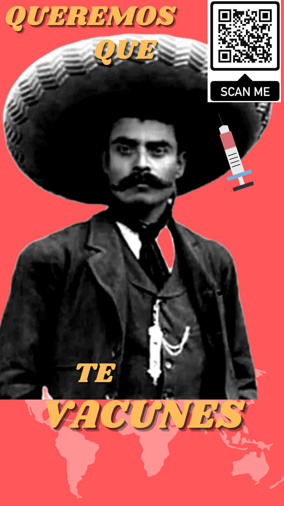

# FrontEnd-Mision-Training🚀

### Práctica CSS - Clonar con CSS

[https://www.rafaelvilches.codes/vaccination/](https://www.rafaelvilches.codes/vaccination/)

#### Campaña Publicitaria

#### Instrucciones

Para la práctica de esta semana tendrán que maquetar en HTML el siguiente caso y generar su repositorio con el ejercicio.
Recordemos que solamente se necesita maquetar como un prototipo, **no es necesario que tenga funcionalidad completa en la información**

Para esta práctica necesito que clonen la página que está en el siguiente enlace [Link del diseño](https://github.com/romarpla/FrontEnd-Mision/blob/main/03%20-%20CSS/practica/landingVacunaci%C3%B3n.png) by [Adhiari Subekti](https://dribbble.com/Adhiari_is)

Como pueden ver es una página de vacunación y en estos momentos que se está poniendo la tercer dosis en varios estados de la república y que en algunos otros se está poniendo la segunda o incluso la primera sigue siendo muy importante recordar toda esta información.

La práctica consiste en lo siguiente:

* Planeación de campaña de vacunación (Un poco de mercadotecnia para llegar al sitio)
* Maquetación del sitio con HTML
* Estilos con CSS (Lo más acercado posible, pueden ser otras imágenes, íconos o colores, pero tiene que ser lo más cercano que puedas)

Bonus:

* Bonus de diseños o páginas adicionales (Totalmente a tu creatividad)
* Bonus de despliegue de la página
